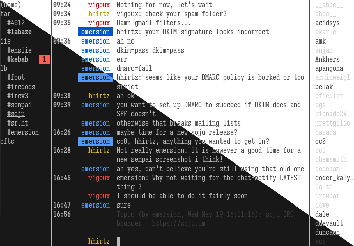

 

*Welcome home, desune~*

**A modern terminal IRC client.**



senpai is an IRC client that works best with bouncers:

- no logs are kept,
- history is fetched from the server via [CHATHISTORY],
- networks are fetched from the server via [bouncer-networks],
- messages can be searched in logs via [SEARCH],
- files can be uploaded via [FILEHOST] (with drag & drop!)

## Quick demo

To try out senpai "online", a live SSH demo is available at:
```shell
ssh -p 6666 delthas.fr
```

Your nick will be set to your SSH username.

*(This connects to the Ergo test network.)*

## Installing

- From your system package repositories: [`senpai`](https://repology.org/project/senpai-irc/versions)
- From source (requires Go):
```shell
git clone https://git.sr.ht/~delthas/senpai
cd senpai
make
sudo make install
```

## Running

From your terminal:
```shell
senpai
```
Senpai will guide you through a configuration assistant on your first run.

Then, type `/join #senpai` on [Libera.Chat] and have a... chat!

See `doc/senpai.1.scd` for more information and `doc/senpai.5.scd` for more
configuration options!

## Debugging errors, testing servers

To debug IRC traffic, run senpai with the `-debug` argument (or put `debug true`) in your config, it will then print in the `home` buffer all the data it sends and receives.

## Issue tracker

Browse tickets at <https://todo.sr.ht/~delthas/senpai>.

To create a ticket, visit the page above, or simply send an email to: [u.delthas.senpai@todo.sr.ht](mailto:u.delthas.senpai@todo.sr.ht) (does not require an account)

## Contributing

Sending patches to senpai is done [by email](https://lists.sr.ht/~delthas/senpai-dev), this is simple and built-in to Git.

### Using pyonji

[pyonji](https://git.sr.ht/~emersion/pyonji) streamlines the Git email contribution workflow.

Install, then after adding your changes to a commit, run `pyonji`.

### Using traditional git tools

Set up your system once by following the steps Installation and Configuration of [git-send-email.io](https://git-send-email.io/)

Then, run once in this repository:
```shell
git config sendemail.to "~delthas/senpai-dev@lists.sr.ht"
```

Then, to send a patch, make your commit, then run:
```shell
git send-email --base=HEAD~1 --annotate -1 -v1
```

It should then appear on [the mailing list](https://lists.sr.ht/~delthas/senpai-dev/patches).

## License

This senpai is open source! Please use it under the ISC license.

Copyright (C) 2021 The senpai Contributors

*senpai was created by taiite, who later handed development over to delthas. This is not a fork, but a continuation of the project initially hosted at https://sr.ht/~taiite/senpai/*

[bouncer-networks]: https://git.sr.ht/~emersion/soju/tree/master/item/doc/ext/bouncer-networks.md
[CHATHISTORY]: https://ircv3.net/specs/extensions/chathistory
[SEARCH]: https://github.com/ircv3/ircv3-specifications/pull/496
[FILEHOST]: https://codeberg.org/emersion/soju/src/branch/master/doc/ext/filehost.md
[Libera.Chat]: https://libera.chat/
[ml]: https://lists.sr.ht/~delthas/senpai-dev
